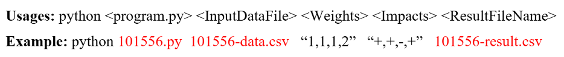

# Topsis Rank Calculation
It takes 4 parameters in cmd as input. First being the input dataset. Second being the Weights. Third being the Impacts. Fourth being the Result file Name


## Installation
```pip install 102217018-topsis```

## License

© 2025 Sarthak Srivastava

This repository is licensed under the MIT license. See LICENSE for details.